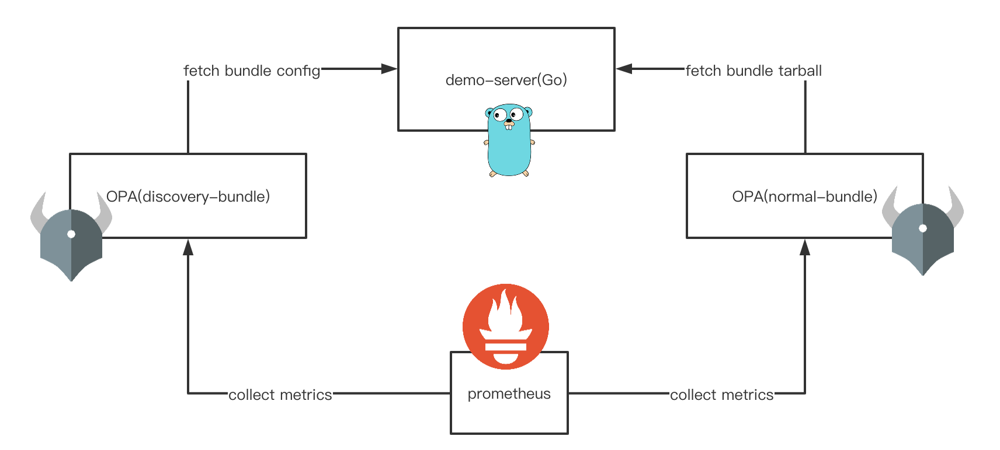
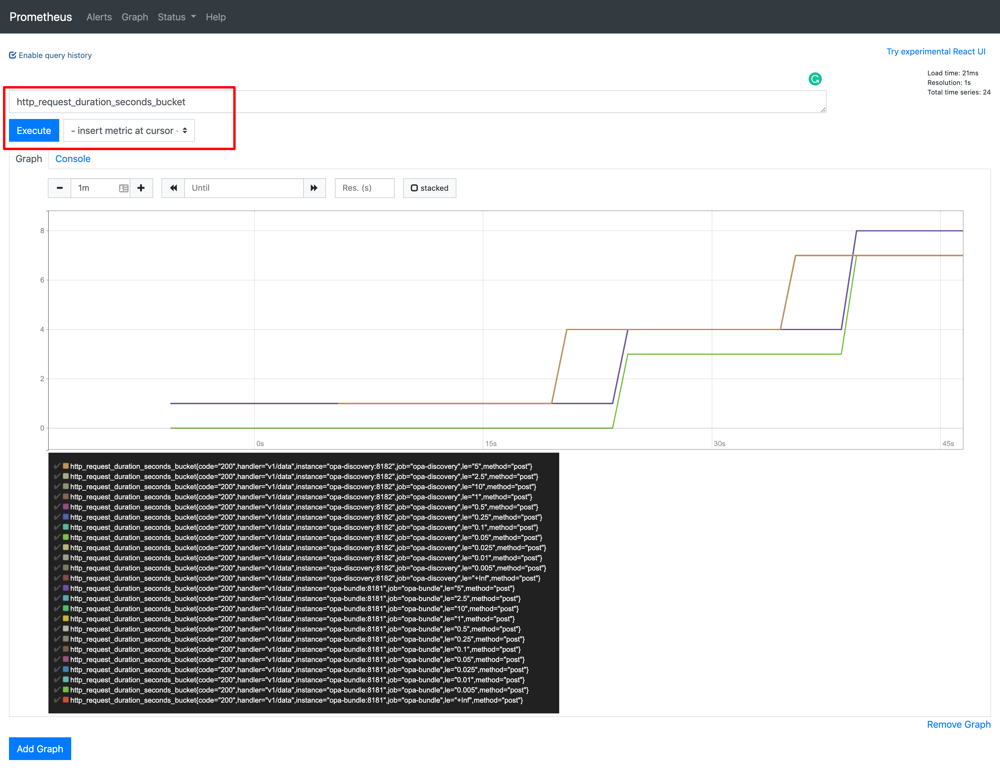
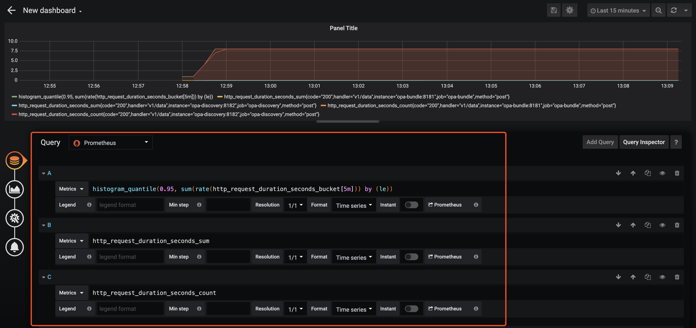

# opa bundle demo

A quick demo of how to use opa bundle



> View [demo code](https://github.com/NewbMiao/opa-koans/tree/master/bundle) in github

## Covered

- bundle api
- decision log api
- status api
- discovery api
- opa go lib integration
- monitor: prometheus, grafana etc

## Cmd usage

```shell
sh bundle/start.sh

Usage:
  slim-version monitor:     start, stop
  advance-version monitor:  start-advance, stop-advance
  container logs:           logs <container name>
  clean all container:      clean
  test opa service:         opa-ping
  query opa decision:       decision-log <decision_id>
```

## Slim version

- opa-bundle
Fetch bundle `rbac.tar.gz` from demo-server, and upload decision-log, report status
See config: `opa/config-bundle.yaml`
- opa-discovery
Fetch discovery config from demo-server, see config: `opa/config-bundle.yaml`
See config: `opa/config-discovery.yaml`
- demo-server
Collect opa-bundle, opa-discovery bundle(discovery) request, and echo received decision-log,status
Also provide opa go lib integration to make decision in `0.0.0.0:8888/auth`
- prometheus
Collect opa-bundle and opa-discovery metrics



```shell
# start
sh bundle/start.sh start
# test opa api
sh bundle/start.sh opa-ping
# stop
sh bundle/start.sh stop
```

## Advanced version

Include addition service

- grafana
Dashboard of metrics

When you want to see prometheus collected metrics:

- Login in http://0.0.0.0:3000 (login name is admin, password is same)
- Create a data source - Url: http://prometheus:9090
- New Dashboard



- node-exporter
Collect host hardware and operating system data
- cadvisor
Collect container data
- alertmanager
Responsible for the alarm

```shell
# start
sh bundle/start.sh start-advance
# test opa api
sh bundle/start.sh opa-ping
# stop
sh bundle/start.sh stop-advance
```

You can change these config to test it locally, hoping it can help you to understand opa bundle more easily.

More info see `scripts/bundleVerify.sh`, which is used for opa-koans's [github action](https://github.com/NewbMiao/opa-koans/actions) now.

[](https://asciinema.org/a/320653)

Some references:

- [opa management api](https://www.openpolicyagent.org/docs/latest/management/)
- [yunlzheng/prometheus-book](https://github.com/yunlzheng/prometheus-book)
- [docker-compose快速搭建 Prometheus+Grafana监控系统](https://juejin.im/post/5c9dc0b06fb9a070ae3da6e7)
